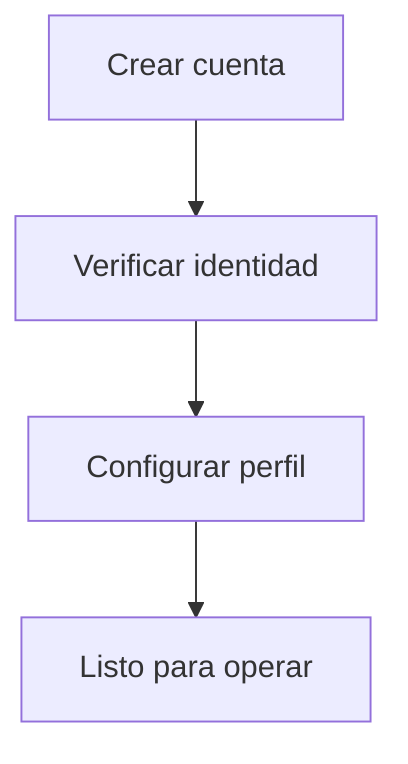
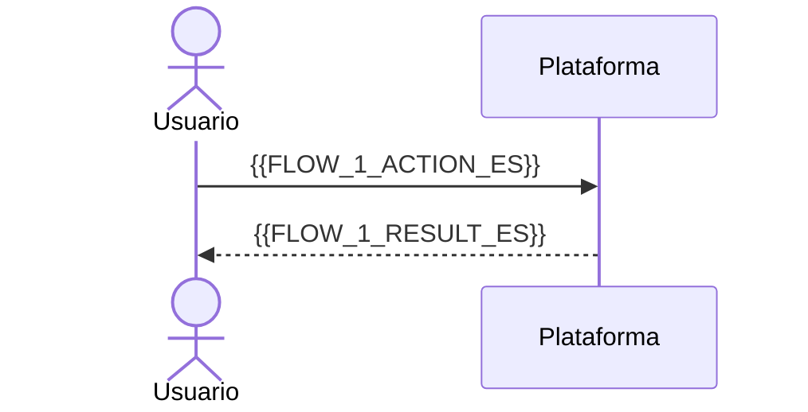

import Tabs from '@theme/Tabs';
import TabItem from '@theme/TabItem';

# 🧭 Guía de plataforma / Platform guide

> Para el cliente final / For end users · 📅 {{DATE}}

:::tip Antes de empezar / Before you start
{{PREREQS_ES}}
:::

<Tabs groupId="lang">
<TabItem value="es" label="🇪🇸 Español" default>

## Introducción

{{INTRO_ES}}

## Onboarding

1. {{ONBOARDING_STEP_1_ES}}
2. {{ONBOARDING_STEP_2_ES}}
3. {{ONBOARDING_STEP_3_ES}}

## Flujos principales

### {{FLOW_1_NAME_ES}}

{{FLOW_1_STEPS_ES}}

:::note Consejo
{{FLOW_1_TIP_ES}}
:::

<!-- Repetir por cada flujo. Incluir capturas en static/img/ si las hay. -->

</TabItem>
<TabItem value="en" label="🇬🇧 English">

## Introduction

{{INTRO_EN}}

## Onboarding

1. {{ONBOARDING_STEP_1_EN}}
2. {{ONBOARDING_STEP_2_EN}}
3. {{ONBOARDING_STEP_3_EN}}

## Main flows

### {{FLOW_1_NAME_EN}}

{{FLOW_1_STEPS_EN}}

:::note Tip
{{FLOW_1_TIP_EN}}
:::

</TabItem>
</Tabs>
