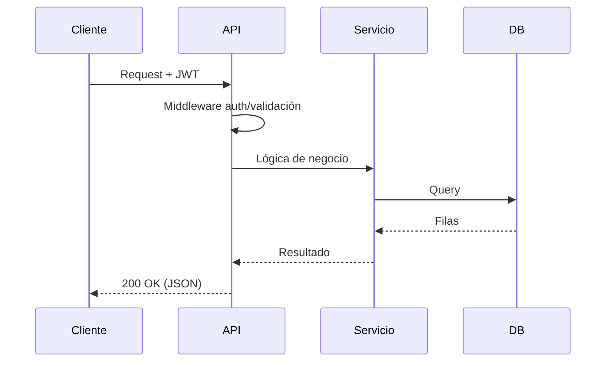
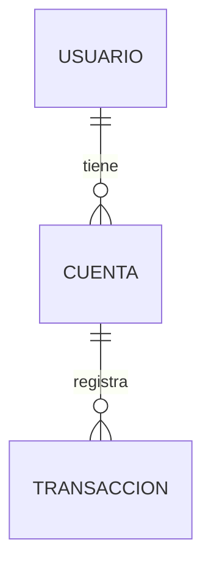

import Tabs from '@theme/Tabs';
import TabItem from '@theme/TabItem';

# 🏗️ Documentación técnica / Technical documentation

> 📅 {{DATE}} · v{{VERSION}} · Stack: **{{STACK}}**

:::info Audiencia / Audience
Documento interno para el equipo de desarrollo. / Internal document for the development team.
:::

<Tabs groupId="lang">
<TabItem value="es" label="🇪🇸 Español" default>

## Visión general

{{OVERVIEW_ES}}

## Arquitectura

{{ARCHITECTURE_ES}}

```mermaid
flowchart LR
  U[Cliente / Client] -->|HTTP| FE[{{LAYER_1}}]
  FE -->|API| BE[{{LAYER_2}}]
  BE -->|SQL| DB[(Base de datos)]
```

:::note Decisiones de diseño
{{DESIGN_DECISIONS_ES}}
:::

## Flujo de una petición (ejemplo)



## Estructura del repositorio

```text title="estructura"
{{REPO_TREE}}
```

## Modelos de datos

{{DATA_MODELS_ES}}



## Setup del entorno

```bash title="Instalación y arranque"
{{SETUP_COMMANDS}}
```

:::caution Variables de entorno
Configura estas variables antes de arrancar. No subas secretos al repo.
:::

| Variable | Descripción | Requerida | Ejemplo |
| -------- | ----------- | --------- | ------- |
{{ENV_VARS_TABLE}}

</TabItem>
<TabItem value="en" label="🇬🇧 English">

## Overview

{{OVERVIEW_EN}}

## Architecture

See the diagram in the Spanish tab. {{ARCHITECTURE_EN}}

:::note Design decisions
{{DESIGN_DECISIONS_EN}}
:::

## Repository structure

```text title="structure"
{{REPO_TREE}}
```

## Data models

{{DATA_MODELS_EN}}

## Environment setup

```bash title="Install & run"
{{SETUP_COMMANDS}}
```

:::caution Environment variables
Set these variables before starting. Never commit secrets.
:::

The environment variable table is shared with the Spanish tab.

</TabItem>
</Tabs>

---

➡️ Sigue con **[Pruebas / Testing](./pruebas)**.
