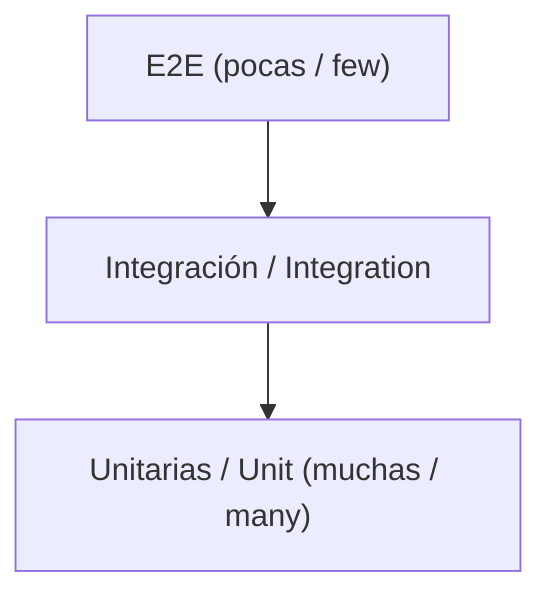

import Tabs from '@theme/Tabs';
import TabItem from '@theme/TabItem';

# ✅ Pruebas / Testing

> 📅 {{DATE}} · Estrategia de calidad / Quality strategy

:::info Resumen / Summary
Cobertura objetivo / Target coverage: **{{COVERAGE_TARGET}}** · Runner: **{{TEST_RUNNER}}**
:::

## Pirámide de pruebas / Test pyramid



| Nivel / Level | Qué cubre / Covers | Herramienta / Tool | Comando / Command |
| ------------- | ------------------ | ------------------ | ----------------- |
| Unitarias / Unit | {{UNIT_SCOPE}} | {{UNIT_TOOL}} | `{{UNIT_CMD}}` |
| Integración / Integration | {{INT_SCOPE}} | {{INT_TOOL}} | `{{INT_CMD}}` |
| E2E | {{E2E_SCOPE}} | {{E2E_TOOL}} | `{{E2E_CMD}}` |

<Tabs groupId="lang">
<TabItem value="es" label="🇪🇸 Español" default>

## Cómo correr las pruebas

```bash title="Pruebas locales"
{{TEST_COMMANDS}}
```

## Cobertura

```bash title="Reporte de cobertura"
{{COVERAGE_CMD}}
```

:::tip Buenas prácticas
- Una aserción clara por caso cuando sea posible.
- Nombrar los tests por comportamiento esperado, no por implementación.
- Datos de prueba aislados; no depender de estado externo.
:::

## Casos críticos a cubrir

- [ ] {{CRITICAL_CASE_1_ES}}
- [ ] {{CRITICAL_CASE_2_ES}}
- [ ] {{CRITICAL_CASE_3_ES}}

## CI

{{CI_NOTES_ES}}

</TabItem>
<TabItem value="en" label="🇬🇧 English">

## How to run tests

```bash title="Local tests"
{{TEST_COMMANDS}}
```

## Coverage

```bash title="Coverage report"
{{COVERAGE_CMD}}
```

:::tip Best practices
- One clear assertion per case when possible.
- Name tests by expected behavior, not implementation.
- Isolated test data; no reliance on external state.
:::

## Critical cases to cover

- [ ] {{CRITICAL_CASE_1_EN}}
- [ ] {{CRITICAL_CASE_2_EN}}
- [ ] {{CRITICAL_CASE_3_EN}}

## CI

{{CI_NOTES_EN}}

</TabItem>
</Tabs>
