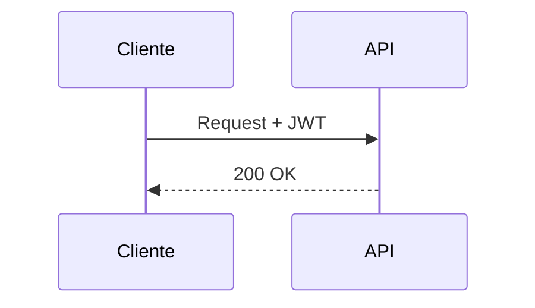

# Contenido enriquecido / Rich content

Para que la documentación no quede plana, usa estos componentes de Docusaurus. La meta es **color,
interacción y detalle**, sin abusar: cada elemento debe aportar claridad, no ruido.

## 1. Admonitions (cajas de color)

Usa cajas para resaltar lo importante. Sintaxis Markdown nativa:

```markdown
:::tip Consejo
Texto útil.
:::
:::info / :::note / :::caution / :::danger
```

Cuándo usarlas:
- `tip` → buenas prácticas, atajos.
- `info` → contexto, audiencia, resumen.
- `note` → decisiones de diseño, aclaraciones.
- `caution` → cosas a configurar con cuidado (variables de entorno).
- `danger` → errores comunes / riesgos en troubleshooting.

## 2. Tabs (pestañas) — ideal para bilingüe y multi-stack

Requiere MDX (archivo `.mdx`) e imports:

```mdx
import Tabs from '@theme/Tabs';
import TabItem from '@theme/TabItem';

<Tabs groupId="lang">
  <TabItem value="es" label="🇪🇸 Español" default>Contenido en español</TabItem>
  <TabItem value="en" label="🇬🇧 English">English content</TabItem>
</Tabs>
```

`groupId="lang"` sincroniza la pestaña elegida entre todas las páginas. Úsalo para ES/EN, y también
para ejemplos por lenguaje (curl / TypeScript / Swift).

## 3. Diagramas Mermaid

Ya está habilitado en `docusaurus.config.js` (`markdown.mermaid` + tema). Tipos útiles:

- `flowchart` → arquitectura, onboarding.
- `sequenceDiagram` → flujo de una petición, interacción usuario↔plataforma.
- `erDiagram` → modelos de datos / relaciones.
- `mindmap` → mapa de la documentación en la portada.

````markdown

````

Genera diagramas **reales** a partir del código (no genéricos): refleja las capas, rutas y entidades
que de verdad existen en el repo.

## 4. Code blocks con título y resaltado

````markdown
```ts title="src/app.ts" {3-5}
const app = express();
app.use(cors());
// highlight lines 3-5
```
````

- `title="..."` muestra el nombre del archivo.
- `{3-5}` o comentarios `// highlight-next-line` resaltan líneas.
- Lenguajes habilitados: bash, json, typescript, swift, sql, diff.

## 5. Badges (etiquetas de color)

Definidos en `custom.css`. Útiles para métodos HTTP y auth:

```html
<span class="badge badge--get">GET</span>
<span class="badge badge--post">POST</span>
<span class="badge badge--put">PUT</span>
<span class="badge badge--delete">DELETE</span>
<span class="badge badge--auth">JWT</span>
```

## 6. Tarjetas de navegación (landing)

En la portada (`intro.md`) usa la grilla de tarjetas (`.card-grid` / `.doc-card` de `custom.css`)
para enlazar las secciones con color y hover. Elimina las tarjetas que no apliquen.

## 7. `<details>` colapsables

Para FAQ y contenido largo opcional:

```markdown
<details>
  <summary>¿Cómo reinicio el entorno?</summary>
  Pasos...
</details>
```

## 8. Checklists

Para "casos críticos a cubrir" o requisitos:

```markdown
- [ ] Caso pendiente
- [x] Caso cubierto
```

## Regla de oro

Cada página debería tener al menos: un admonition de contexto, un diagrama o tabla, y code blocks con
título cuando muestre comandos. Pero no metas un diagrama solo por meterlo — debe explicar algo que el
texto no transmite igual de bien.
